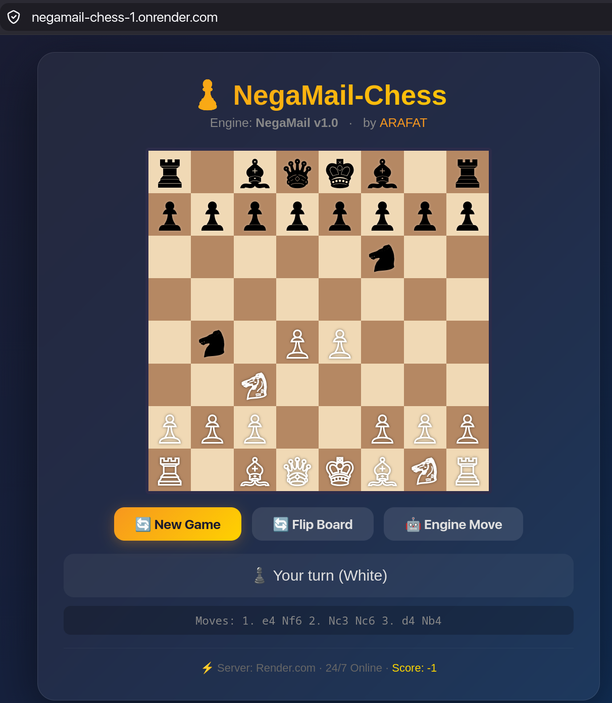

<div align="center">

# ♟️ NegaMail-Chess

[](https://negamail-chess-1.onrender.com)
[](https://isocpp.org/)
[](https://www.python.org/)
[](https://flask.palletsprojects.com/)

*A chess engine built from scratch — no chess libraries, no shortcuts.*

### 🎮 [**Play it live →**](https://negamail-chess-1.onrender.com)
<sub>Free-tier Render instance — may take ~30s to wake up on first load.</sub>

</div>

A chess engine written from scratch in C++ ♜ — 0x88 board representation, negamax search with alpha-beta pruning, UCI protocol support — wrapped in a Flask API and playable from the browser.

<div align="center">
  
</div>

---

## 🔍 Overview

NegaMail-Chess is a full-stack chess engine project:

- **Engine core (C++):** move generation, legal move filtering, **negamax search with alpha-beta pruning**, and material + piece-square-table evaluation, all built on a **0x88 board**.
- **UCI layer:** speaks the standard Universal Chess Interface protocol (`uci`, `isready`, `position`, `go`, `stop`, `quit`), so it can talk to any UCI-compatible GUI, not just this app.
- **API (Python/Flask):** spawns the engine as a subprocess per request, drives it over UCI, and exposes clean JSON endpoints.
- **Frontend:** a browser-based board to play against the engine directly.

> Deployed 24/7 on **Render**, free tier, via a Docker build.

---

## ✨ Features

- 🧠 **Negamax search** with alpha-beta pruning
- ♟️ **Full legal move generation** — castling, en passant, promotion, check evasion
- 📐 **0x88 board representation** for fast off-board detection
- 📊 **Material + piece-square-table evaluation**
- 🔌 **Standard UCI protocol** — drop it into any chess GUI
- 🌐 **REST API** (`/move`, `/analyze`, `/health`) for web integration
- 🐳 **Dockerized build** for reproducible deploys

---

## 🏗️ Architecture

```
Browser (index.html)
      │  fetch("/move", { fen })
      ▼
Flask API (app.py)
      │  spawns subprocess, speaks UCI over stdin/stdout
      ▼
Engine binary (C++: main.cpp → uci.cpp → search.cpp → evaluate.cpp → board.cpp)
```

Each request to `/move` starts a fresh engine process, completes the UCI handshake, sends the position, searches, and returns the best move — stateless by design.

---

## 🛠️ Tech Stack

| Layer      | Tech                                    |
|------------|------------------------------------------|
| Engine     | C++17, 0x88 board, negamax + alpha-beta   |
| API        | Python, Flask, Gunicorn                   |
| Frontend   | HTML/JS (chess.js + board UI)             |
| Deploy     | Docker, Render.com                        |

---

## 🚀 Getting Started

Clone the repo:

```bash
git clone https://github.com/arafat01rahman/NegaMail-Chess.git
cd NegaMail-Chess
```

### 1. Build the engine

```bash
make
```

This runs `g++ -g -std=c++17 -Wall main.cpp board.cpp evaluate.cpp search.cpp uci.cpp -o engine` and produces an `engine` binary in the repo root.

To clean up:

```bash
make clean
```

### 2. Try the engine standalone (UCI mode)

```bash
./engine
```

Then type directly into stdin:

```
uci
isready
position startpos
go depth 4
```

### 3. Run the Flask API

```bash
pip install -r requirements.txt
python app.py
```

Open `http://localhost:5000` and play against it in the browser.

### 4. (Optional) Run it exactly like production, via Docker

```bash
docker build -t negamail-chess .
docker run -p 5000:5000 negamail-chess
```

---

## 📁 Project Structure

```
.
├── main.cpp          # entry point
├── board.h/.cpp       # 0x88 board, move generation, make/unmake
├── evaluate.h/.cpp    # material + piece-square tables
├── search.h/.cpp      # negamax + alpha-beta
├── uci.h/.cpp         # UCI protocol implementation
├── app.py             # Flask API wrapping the engine
├── Makefile
├── requirements.txt
├── Dockerfile
├── render.yaml
└── static/
    ├── index.html
    └── pic.png
```
